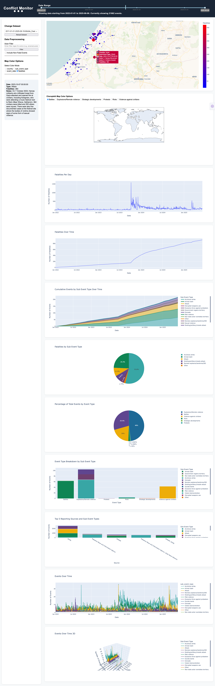

# __Conflict Monitor__ - Project for MIN-VISH, 2025, Ahlers
## [GitHub](https://github.com/JannikRosendahl/VISH-Project)
# __Conflict Monitor__ - Project for MIN-VISH, 2025, Ahlers
## [GitHub](https://github.com/JannikRosendahl/VISH-Project)
## Team Members
- Erik Burmester | [Mail](mailto:erik.burmester@stud.hs-hannover.de) | [GitHub](https://github.com/ProgrammIt)
- Lukas Müller | [Mail](mailto:lukas.mueller2@stud.hs-hannover.de) | [GitHub](https://github.com/mrfloppy93)
- Jannik Rosendahl | [Mail](mailto:jannik.rosendahl@stud.hs-hannover.de) | [GitHub](https://github.com/JannikRosendahl)

## Setup
### Docker
```bash
docker compose up
```

### Manual Python

#### Create and activate virtual environment on Linux/macOS
#### Create and activate virtual environment on Linux/macOS
```bash
python -m venv .venv
source .venv/bin/activate
```

#### Create and activate virtual environment on Windows
```cmd
python -m venv .venv
.venv/Script/Activate.ps1
```

#### Install dependencies
```bash
pip install -r requirements.txt
```

#### Running the application
```bash
python app.py
```

### Additional Setup Notes
- open the application in your browser at [http://127.0.0.1:8050/](http://127.0.0.1:8050/)
- load additional ACLED data by placing the files in the `data` directory and selecting them in the application
  - ACLED always uses the same _CSV_ format, so most datasets should be compatible

## Source of Data
- [acleddata.com](https://acleddata.com/curated-data-files/)
- Description of data format: [ACLED Data Format](https://acleddata.com/knowledge-base/codebook/)

## Source of Code / Libraries
- Python Framework: [Plotly.py](https://dash.plotly.com/)
- Python Libraries:
  - `dash`: Plotly Base Framework
  - `plotly`: Plotly Express Components
  - `pandas`: Loading and Handling of CSV Data
  - `chardet`: Handling file encodings

## Visualization techniques

In this section, we provide an overview of the chart types used in this project. Detailed information can be found in subsections dedicated to each chart. The order of the subsections reflects the order present on the website.

- Map
- Stacked histogram
- Stacked bar chart
- Line graph
- Pie chart

### World map

The world map is an essential part of the *conflict monitor*, as it gives an overview of all events contained in a given dataset.
The map chart is interactive. The user is able to zoom in and out or move around the world. The events shown are interactive as well.
The user can hover over an *event* of interest in order to gain some insights. If the user selects an *event* by clicking it, all available information regarding this *event* will be displayed on the left-hand side of the map chart. The following image demonstrates this.


The world map is an instance of *dash*'s `px.scatter_map` class. The world map offers four different visualizations modes.

The first one, can be used to filter the events by `country`, while the second one can be used to filter by `event_type`. Both modes show *qualitative* data on the map, which is color encoded using the `px.colors.qualitative.Alphabet` color map.

The third mode applies a filter for `event_date`, which causes the events to be filtered by date. If this mode is used, the data displayed on the map is *continuous*. For color encoding `px.colors.sequential.Plasma` is used.

The fourth mode on the other hand applies a filter for events with `fatalities`. If selected, the map shows *continuous* data as well. For color encoding `px.colors.sequential.matter` is used. The size of the dot representing an event scales with the number of fatalities.

### Region map

This chart is only displayed, when the dataset on the Ukraine war is loaded. This chart shows the regions of Ukraine. This map offers six filters for filtering by different `sub_event_type`s: `battles`, `explosions/remote violence`, `strategic developement`, `protests`, `riots`, `violence against civilians`.

### Line chart showing fatalities over time

This chart shows the development of fatalities over the selected time frame.
The *cardinal* data is an instance of the `px.line` class.

### Line chart showing cumulative fatalities over time

This chart shows the sum of fatalities over the selected time frame.
The *cardinal* data is an instance of the `px.line` class.

### Stacked histogram showing the sum of occurrences per event over time

This chart shows the sum of occurrences per event over the selected time frame. The multi-variate data is plotted using an instance of the `px.area` class. The time is shown on the x-axis and the sum of the occurrences is shown on the y-axis.

### Pie chart showing percentage of fatalities by event type

This pie chart illustrates the proportion of total fatalities attributed to each event type within the selected dataset. Each slice represents an `event_type` (such as `battles`, `protests`, or `violence against civilians`), and the size of the slice corresponds to the percentage of fatalities caused by that event type. The chart is generated using the `px.pie` class, providing a clear visual summary of which event types are associated with the highest number of deaths.

### Pie chart showing percentage of event types occurrences

This pie chart visualizes the distribution of different event types within the selected dataset. Each slice of the pie represents a `event_type` (such as `battles`, `protests`, or `violence against civilians`), and the size of each slice corresponds to the proportion of that sub-event type relative to the total number of events. For this plot, the `px.pie` class is used.

### 

- stacked bar chart:
		- `px.bar(..., barmode='stack')`
		- x-axis is nominal
		- used in:
			- _Event Type Breakdown by Sub Event Type_		
			- _Top 5 Reporting Sources and Sub Event Types_
			- _events-over-time_


## Additional Screenshots
### Map in Fatalities-Mode


### Map in Time-Mode


### Middle East dataset, fatalities highlighted


### Europe Dataset, filtered to Germany 2023-2025, event-types highlighted

### Additional Setup Notes
- open the application in your browser at [http://127.0.0.1:8050/](http://127.0.0.1:8050/)
- load additional ACLED data by placing the files in the `data` directory and selecting them in the application
  - ACLED always uses the same _CSV_ format, so most datasets should be compatible

## Source of Data
- [acleddata.com](https://acleddata.com/curated-data-files/)
- Description of data format: [ACLED Data Format](https://acleddata.com/knowledge-base/codebook/)

## Source of Code / Libraries
- Python Framework: [Plotly.py](https://dash.plotly.com/)
- Python Libraries:
  - `dash`: Plotly Base Framework
  - `plotly`: Plotly Express Components
  - `pandas`: Loading and Handling of CSV Data
  - `chardet`: Handling file encodings

## Visualization techniques

In this section, we provide an overview of the chart types used in this project. Detailed information can be found in subsections dedicated to each chart. The order of the subsections reflects the order present on the website.

- Map
- Stacked histogram
- Stacked bar chart
- Line graph
- Pie chart

### World map

The world map is an essential part of the *conflict monitor*, as it gives an overview of all events contained in a given dataset.
The map chart is interactive. The user is able to zoom in and out or move around the world. The events shown are interactive as well.
The user can hover over an *event* of interest in order to gain some insights. If the user selects an *event* by clicking it, all available information regarding this *event* will be displayed on the left-hand side of the map chart. The following image demonstrates this.


The world map is an instance of *dash*'s `px.scatter_map` class. The world map offers four different visualizations modes.

The first one, can be used to filter the events by `country`, while the second one can be used to filter by `event_type`. Both modes show *qualitative* data on the map, which is color encoded using the `px.colors.qualitative.Alphabet` color map.

The third mode applies a filter for `event_date`, which causes the events to be filtered by date. If this mode is used, the data displayed on the map is *continuous*. For color encoding `px.colors.sequential.Plasma` is used.

The fourth mode on the other hand applies a filter for events with `fatalities`. If selected, the map shows *continuous* data as well. For color encoding `px.colors.sequential.matter` is used. The size of the dot representing an event scales with the number of fatalities.

### Region map

This chart is only displayed, when the dataset on the Ukraine war is loaded. This chart shows the regions of Ukraine. This map offers six filters for filtering by different `sub_event_type`s: `battles`, `explosions/remote violence`, `strategic developement`, `protests`, `riots`, `violence against civilians`.

### Line chart showing fatalities over time

This chart shows the development of fatalities over the selected time frame.
The *cardinal* data is an instance of the `px.line` class.

### Line chart showing cumulative fatalities over time

This chart shows the sum of fatalities over the selected time frame.
The *cardinal* data is an instance of the `px.line` class.

### Stacked histogram showing the sum of occurrences per event over time

This chart shows the sum of occurrences per event over the selected time frame. The multi-variate data is plotted using an instance of the `px.area` class. The time is shown on the x-axis and the sum of the occurrences is shown on the y-axis.

### Pie chart showing percentage of fatalities by event type

This pie chart illustrates the proportion of total fatalities attributed to each event type within the selected dataset. Each slice represents an `event_type` (such as `battles`, `protests`, or `violence against civilians`), and the size of the slice corresponds to the percentage of fatalities caused by that event type. The chart is generated using the `px.pie` class, providing a clear visual summary of which event types are associated with the highest number of deaths.

### Pie chart showing percentage of event types occurrences

This pie chart visualizes the distribution of different event types within the selected dataset. Each slice of the pie represents a `event_type` (such as `battles`, `protests`, or `violence against civilians`), and the size of each slice corresponds to the proportion of that sub-event type relative to the total number of events. For this plot, the `px.pie` class is used.

### 

- stacked bar chart:
		- `px.bar(..., barmode='stack')`
		- x-axis is nominal
		- used in:
			- _Event Type Breakdown by Sub Event Type_		
			- _Top 5 Reporting Sources and Sub Event Types_
			- _events-over-time_


## Additional Screenshots
### Map in Fatalities-Mode


### Map in Time-Mode


### Middle East dataset, fatalities highlighted


### Europe Dataset, filtered to Germany 2023-2025, event-types highlighted
